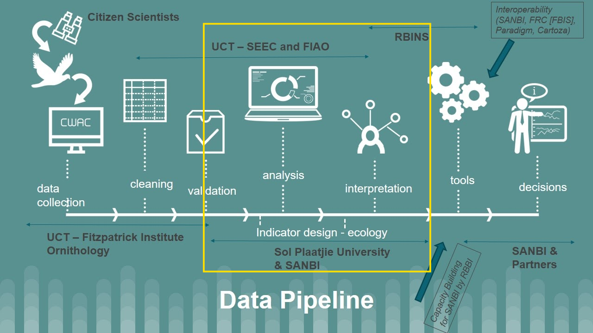
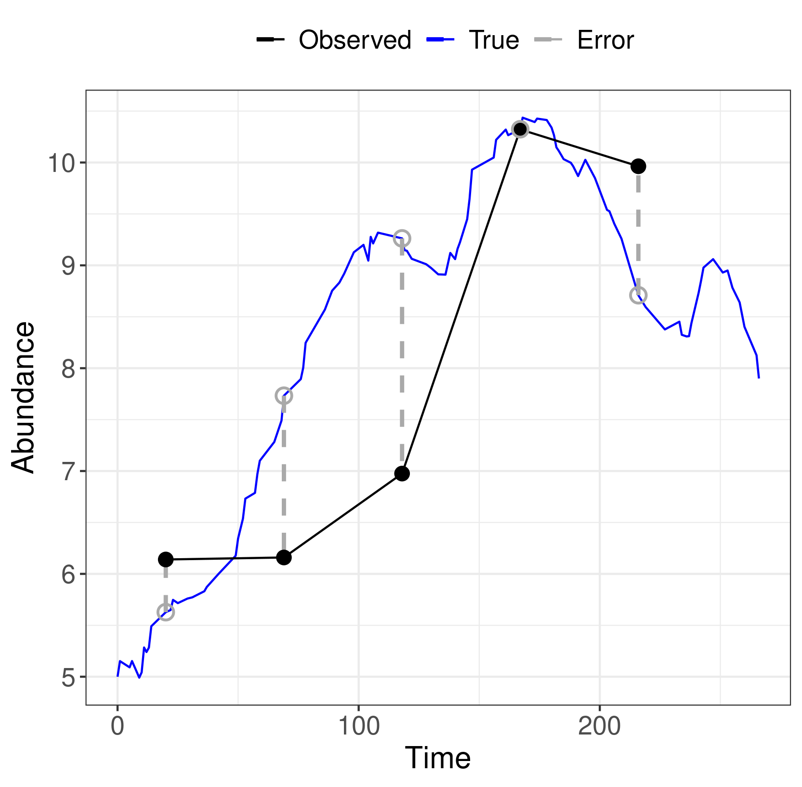
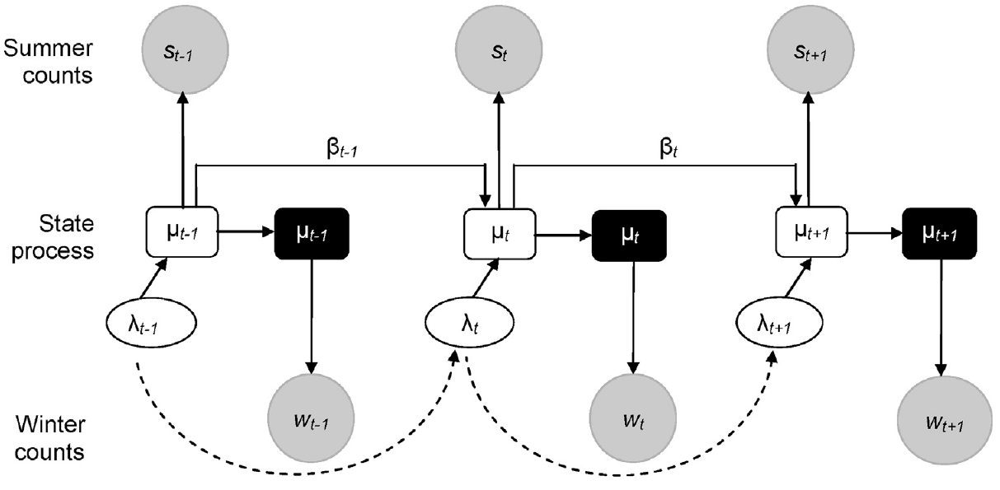
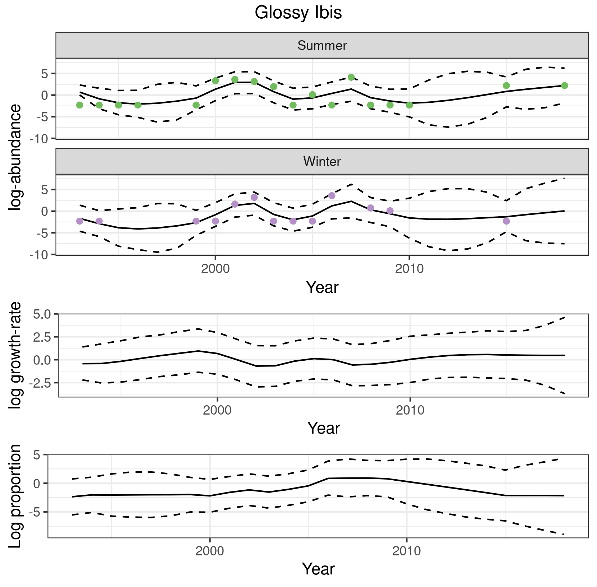
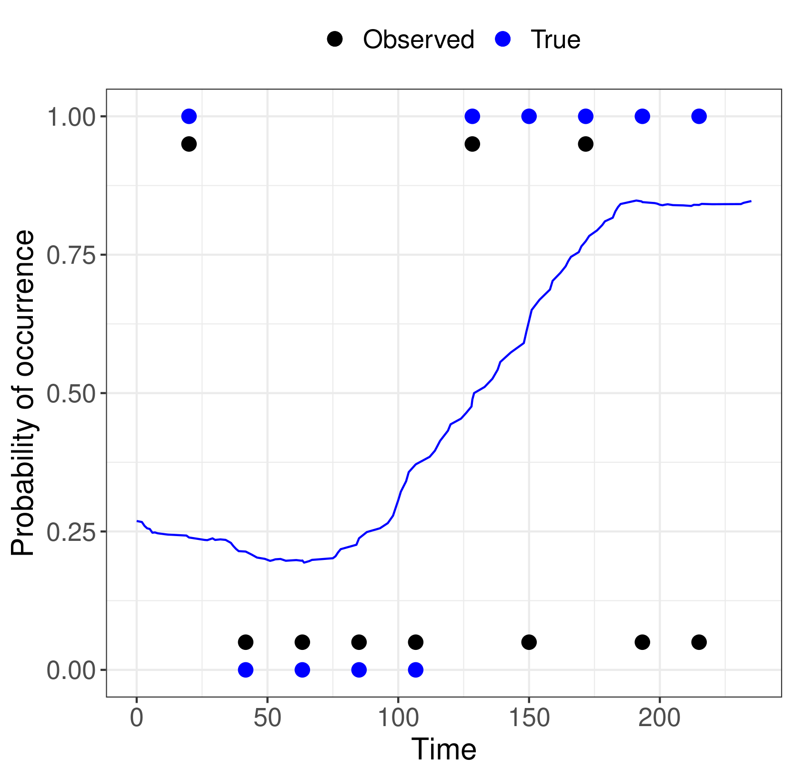

```{r setup, include=FALSE}
knitr::opts_chunk$set(echo = FALSE)
```

## Data pipeline


```{r, out.width="70%", include=TRUE, fig.align="center", echo=F}

```


## The types of decisions that need to be supported


- Site reports and management plans.

- Provincial State of Biodiversity Report.

- National State of Environment Report.

- Red List and National Biodiversity Assessments.

- Agreement on the Conservation of African-Eurasian Migratory Waterbirds.

- ...

## Objectives

- Estimate metrics such as:

    - distribution,
    - abundance,
    - population trend,
    - species diversity.
    
- Integrate these metrics for different populations.

- Model observation error.


## State-space models

  - Dynamic models describe how processes change over time.
  
  - Account for observation error.
  
\vspace{1cm}

\begin{center}
\includegraphics[height=3cm]{"ssm_diagram.png"}
\end{center}


## Observation error: abundance example


```{r observationerror, out.width="50%", include=TRUE, fig.align="center", echo=F}

```

## A state-space model for CWAC

\begin{columns}[]
  \column{0.55\textwidth}{
    
    \begin{itemize}
      \item Two counts per year: summer and winter.
      \item + additional counts.
      \item Sites must be well defined in terms of spatial limits.
      \item Standardized counts in terms of: number of observers,
      routes, time of day, viewing techniques, etc.
    \end{itemize}
    
  }
  \column{0.40\textwidth}{
  \flushleft
    \includegraphics[width=0.9\textwidth]{cwac_logo.png}
    http://cwac.birdmap.africa
  }
\end{columns}

## A state-space model for CWAC


```{r, out.width="70%", include=TRUE, fig.align="center", echo=F, fig.cap = "Barshep et al. 2017. Global Ecology and Conservation, 12"}

```


## A state-space model for CWAC


```{r, out.width="55%", include=TRUE, fig.align="center", echo=F}

```


## Observation error: occupancy example

```{r, out.width="50%", include=TRUE, fig.align="center", echo=F, fig.cap = "Some figure legend, if needed..."}

```


## Occupancy models

I've got a few slides that I normally use to explain the basics about occupancy models; I've used them in a few toolbox seminars and some of the graphs in the 'template' file were from that.

## Indices, etc.
