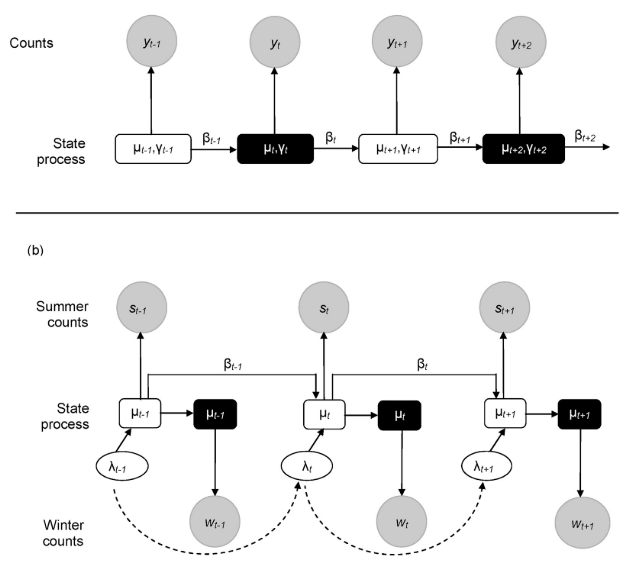

```{r setup, include=FALSE}
knitr::opts_chunk$set(echo = FALSE)
```

## Data pipeline


```{r, out.width="70%", include=TRUE, fig.align="center", echo=F, fig.cap = "Some figure legend, if needed..."}
knitr::include_graphics("birdie_str.png")
```


## The types of decisions that need to be supported


- Site reports and management plans.

- Provincial State of Biodiversity Report.

- National State of Environment Report.

- Red List and National Biodiversity Assessments.

- Agreement on the Conservation of African-Eurasian Migratory Waterbirds.

- ...

## Objectives

- Estimate metrics such as:

    - distribution,
    - abundance,
    - population trend,
    - species diversity.
    
- Integrate these metrics for different populations.

- Model observation error.


## State-space models

  - Dynamic models describe how processes change.
  
  - Account for observation error.
  
\vspace{1cm}

\begin{center}
\includegraphics[height=3cm]{"ssm_diagram.png"}
\end{center}


## Observation error: abundance example


```{r observationerror, out.width="50%", include=TRUE, fig.align="center", echo=F, fig.cap = "Some figure legend, if needed..."}
knitr::include_graphics("abund_obs.png")
```

## A state-space model for abundance


```{r, out.width="50%", include=TRUE, fig.align="center", echo=F}

```


## A state-space model for abundance

I think we should show some results slides here. Do you have some results ready? Otherwise, we can also show some of the figures from Yahkat or Birgit's papers.


## Observation error: occupancy example

```{r, out.width="50%", include=TRUE, fig.align="center", echo=F, fig.cap = "Some figure legend, if needed..."}
knitr::include_graphics("occu_obs.png")
```


## Occupancy models

I've got a few slides that I normally use to explain the basics about occupancy models; I've used them in a few toolbox seminars and some of the graphs in the 'template' file were from that.

## Indices, etc.
